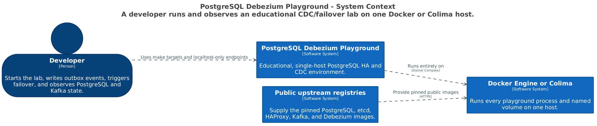

# PostgreSQL Debezium Playground

> **Educational single-host lab only. Do not use this repository as a production deployment blueprint.**

This playground makes PostgreSQL 16 leader failover and at-least-once Debezium CDC observable on Docker Engine or Colima. It runs three Patroni/PostgreSQL members, three etcd voters, a stable HAProxy write endpoint, one KRaft Kafka broker, and one Debezium Connect worker.

PostgreSQL and etcd have redundant processes, but every process still shares one host. Kafka, Connect, and HAProxy are intentionally single-instance services.

## Architecture at a glance



The playground is one local software system supplied by public upstream images and operated through `make` targets and loopback-only endpoints. See [the architecture guide](docs/architecture.md) for the detailed container view.

## Platform support

The primary setup is a Linux host running Docker Engine and the Docker Compose v2 plugin. The playground itself has no macOS dependency; macOS and Colima are optional ways to provide a compatible Docker runtime.

Host prerequisites are Docker Engine 27 or newer, Docker Compose 2.30 or newer, `bash`, `curl`, `jq`, `openssl`, and `make`. The static checks additionally require Git, `grep`, and ShellCheck. Commands use `docker compose`; the legacy Compose v1 `docker-compose` command is not supported.

## Quick start

On Linux, ensure the Docker daemon is running and accessible to your user, then run:

```sh
docker version
docker compose version
make init
make up
make status
make verify
```

On macOS, Colima can provide the Docker runtime. Allocate at least 4 CPUs, 8 GiB RAM, and 30 GiB disk, then use the same `make` commands:

```sh
colima start --cpu 4 --memory 8 --disk 30
docker version
docker compose version
make init
make up
make status
make verify
```

`make init` creates mode-0600 credentials in `.state/credentials.env`. `make down` preserves all named volumes. `make reset` displays and removes the project volumes and generated credentials only after explicit confirmation.

## Entry points

| Command | Purpose |
|---|---|
| `make init` | Generate or reuse local credentials. |
| `make up` | Build and start the complete healthy stack. |
| `make status` | Report Compose, etcd, Patroni, HAProxy, Kafka, connector, publication, and slot state. |
| `make verify` | Exercise replication, CDC, promotion, rejoin, and persistence. |
| `make failover` | Stop the discovered primary, verify promotion, then restart and verify rejoin. |
| `make logs` | Follow project logs. |
| `make down` | Stop services without deleting volumes. |
| `make reset` | Explicitly delete project volumes and generated credentials. |
| `make diagrams` | Rebuild the embedded C4 PNGs from the Structurizr DSL source. |

## Local endpoints

| Endpoint | Address | Purpose |
|---|---|---|
| PostgreSQL write | `127.0.0.1:5432` | HAProxy-selected Patroni primary |
| Kafka | `127.0.0.1:9092` | local clients |
| Connect REST | `127.0.0.1:8083` | connector inspection |
| Patroni APIs | `127.0.0.1:8008-8010` | member diagnostics |

etcd, PostgreSQL member ports, the Kafka controller, and internal listeners are not exposed to the host.

## What verification proves

The verification workflow requires one primary, two streaming replicas, three healthy etcd voters, pre- and post-promotion CDC events, former-primary rejoin, and persistence across a non-destructive restart. Delivery is at-least-once: duplicate records around failover are permitted and reported; missing correlation IDs fail verification.

PostgreSQL replication is asynchronous. Existing client connections may break on promotion and must reconnect. PostgreSQL 16 logical-slot behavior in this lab is not a zero-loss guarantee.

Read [Getting started](docs/getting-started.md), [the failover scenario](docs/failover-scenario.md), [the CDC flow](docs/cdc-flow.md), [security](docs/security-model.md), [limitations](docs/limitations.md), and [troubleshooting](docs/troubleshooting.md) before experimenting.
