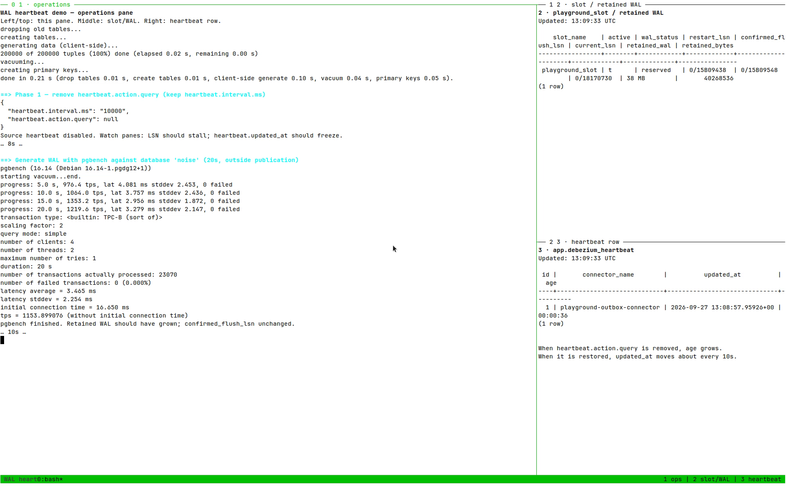
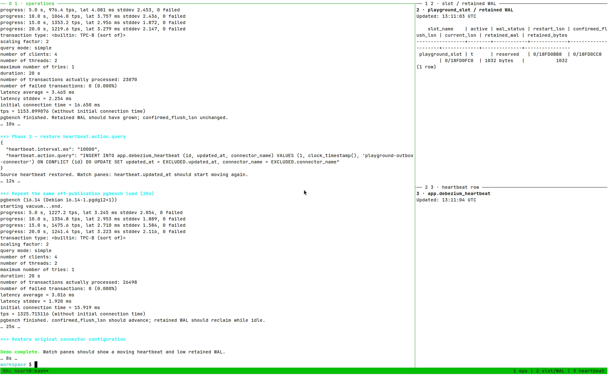

<!-- Suggested inserts for index.md — adjust paths to your Hugo page bundle. -->

## Prove that the heartbeat works

Do not validate this with writes to a captured table. That traffic already moves the slot and hides the failure.

Use a test environment and generate sustained writes only against tables outside the captured set. Record `restart_lsn`, `confirmed_flush_lsn`, retained WAL bytes, and disk usage.

Without the source heartbeat, the slot position should stall while retained WAL grows:



<!-- Or plain HTML / Markdown if you do not use a video shortcode:

<video controls src="01-without-source-heartbeat.mp4"></video>

-->

After enabling the action query, confirm that:

1. The heartbeat row changes at the configured interval.
2. The change belongs to the connector's publication.
3. `confirmed_flush_lsn` advances.
4. `restart_lsn` follows as PostgreSQL releases its decoding requirements.
5. Retained WAL stops growing without bound.
6. No heartbeat record appears in a business topic.



<!-- Or:

<video controls src="02-with-source-heartbeat.mp4"></video>

-->

A passing test proves the full path. Checking that the SQL statement ran proves only the first step.
