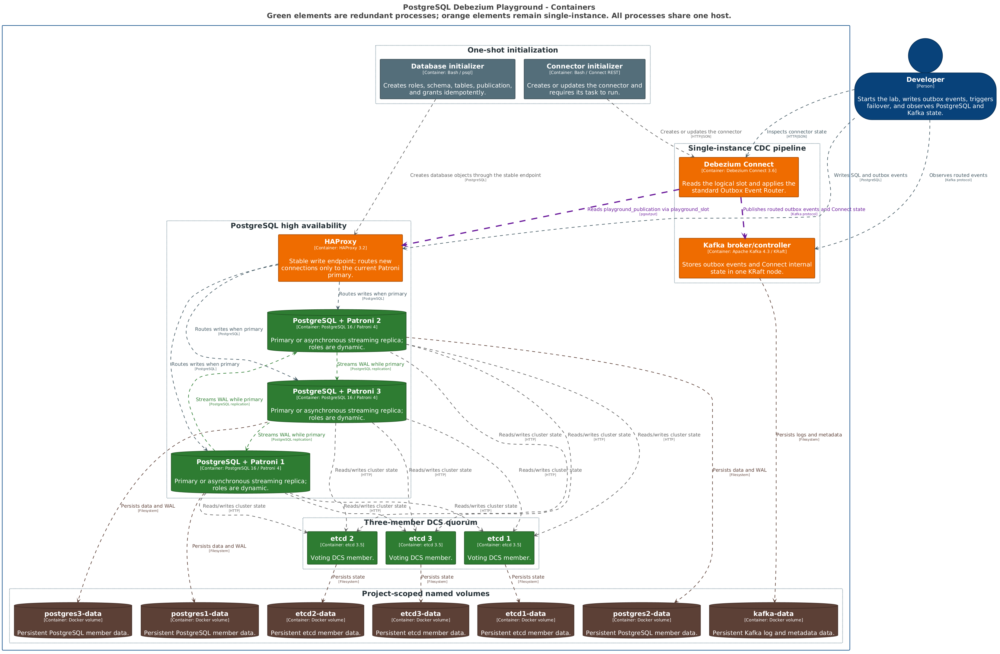

# Architecture

The playground is a single Docker Compose project on one bridge network. It is deliberately educational and is not a production HA distribution.

## Container diagram

Green processes are redundant members inside the single host. Orange processes—HAProxy, Kafka, and Debezium Connect—are deliberately single-instance. Gray initializers exit after successful idempotent setup, and brown cylinders are project-scoped named volumes. The editable source is [`c4/src/workspace.dsl`](c4/src/workspace.dsl); run `make diagrams` to regenerate both embedded PNGs.

## Processes and responsibilities

| Service | Count | Responsibility | Persistent volume | Health definition |
|---|---:|---|---|---|
| etcd | 3 | Patroni distributed configuration store and leader lease | one per member | local `etcdctl endpoint health` |
| PostgreSQL + Patroni | 3 | One writable primary and two asynchronous streaming replicas | one per member | Patroni REST plus `pg_isready` |
| HAProxy | 1 | Stable write endpoint selected through Patroni `/primary` | none | at least one PostgreSQL backend is `UP` |
| Kafka | 1 | Combined KRaft broker/controller | one | broker metadata request |
| Debezium Connect | 1 | PostgreSQL CDC and Outbox Event Router | Connect state in Kafka | REST API responds |
| database-init | 1 | Idempotent roles, database, schema, tables, grants, and publication | none | successful exit |
| connector-init | 1 | Idempotent connector create/update and state check | none | successful exit |

The nine long-running processes are three etcd members, three PostgreSQL/Patroni members, HAProxy, Kafka, and Connect. The two initializers run once per `up` and exit.

## Data and control flow

Applications connect to HAProxy at `127.0.0.1:5432`. HAProxy probes each Patroni API and sends new connections only to the member returning HTTP 200 for `/primary`. Existing connections may fail during promotion and must reconnect.

Patroni stores cluster state in the three-member etcd quorum. PostgreSQL replication is asynchronous. Initial bootstrap enables `wal_level=logical`, sufficient sender/slot capacity, data checksums, `pg_rewind`, and a Patroni-managed permanent logical slot named `playground_slot`.

Debezium reaches PostgreSQL through HAProxy, reads `playground_publication` with `pgoutput`, and routes `app.outbox_events` through the standard Outbox Event Router. Kafka and Connect are single instances and are not highly available.

## Frozen identifiers and event contract

- Database: `playground`
- Schema/table: `app.outbox_events`
- Publication: `playground_publication`
- Logical slot: `playground_slot`
- Connector: `playground-outbox-connector`
- Topic namespace: `playground`

Outbox rows contain `id`, `correlation_id`, `aggregate_type`, `aggregate_id`, `event_type`, `payload`, and `created_at`. The Kafka record key is `aggregate_id`; the event UUID and caller-supplied correlation UUID are headers; the value is the JSON payload. Topics are `playground.events.<aggregate_type>`.
